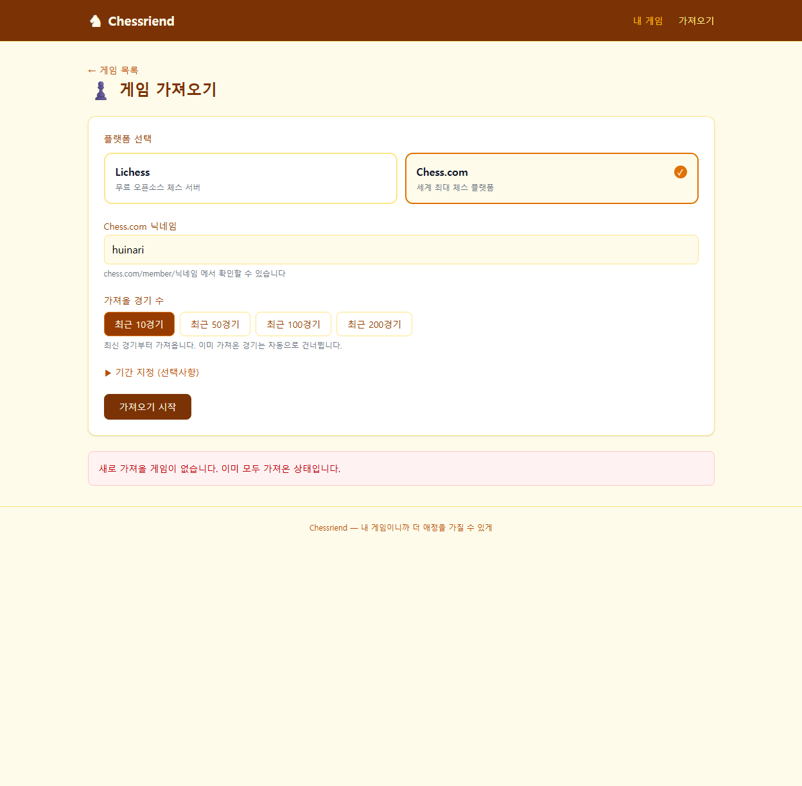
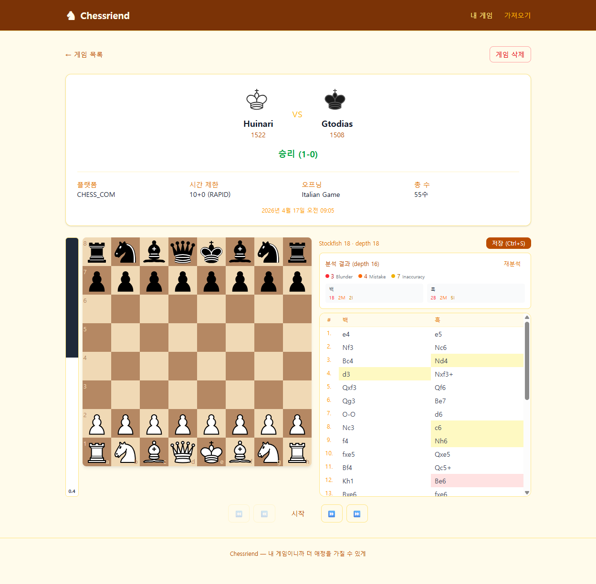

# bugfix/import-game-count 테스트 가이드

## 버그 재현 시나리오 (수정 전)

### 전제 조건
- 이미 100경기 이상 가져온 상태

### 재현 단계
1. `/import` 페이지 이동
2. Chess.com 선택, 동일한 사용자명 입력
3. "최근 10경기" 또는 "최근 50경기" 선택 후 "가져오기 시작" 클릭
4. **수정 전**: "Import 중 오류가 발생했습니다. 사용자명을 확인해주세요." 에러 표시
5. **수정 후**: "새로 가져올 게임이 없습니다. 이미 모두 가져온 상태입니다." 표시

---

## 테스트 케이스

### TC-1: 중복 게임만 있을 때 (핵심 버그 수정)
1. 먼저 Chess.com에서 100경기 이상 가져오기
2. 같은 사용자명으로 "최근 10경기" 가져오기 시도
3. **기대 결과**: "새로 가져올 게임이 없습니다. 이미 모두 가져온 상태입니다." 메시지 표시
4. 에러(빨간 배경)가 아닌 안내(노란 배경) 스타일이어야 함

### TC-2: 존재하지 않는 사용자명
1. Chess.com 선택
2. 존재하지 않는 사용자명 입력 (예: `thisuserdoesnotexist123456789`)
3. "최근 10경기" 선택 후 "가져오기 시작" 클릭
4. **기대 결과**: "Import 중 오류가 발생했습니다. 사용자명을 확인해주세요." 에러 표시

### TC-3: 정상 가져오기 (새 게임 존재)
1. Chess.com 선택, 유효한 사용자명 입력
2. 아직 가져오지 않은 경기가 포함된 범위 선택 (예: "최근 200경기" — 이전에 100경기만 가져왔다면)
3. **기대 결과**: 새 게임들이 하나씩 목록에 추가되며, 완료 후 정상 종료

### TC-4: 게임 분석 (Blunder/Mistake/Inaccuracy 표시)
1. `/games` 페이지에서 아무 게임 클릭
2. 게임 뷰어에서 "게임 분석" 버튼 클릭
3. Stockfish depth 16 분석 진행 (진행률 표시)
4. **기대 결과**:
   - 분석 결과 요약 표시 (Blunder/Mistake/Inaccuracy 개수)
   - 백/흑 분리 통계 표시 (예: 백 1B 2M 2I, 흑 2B 2M 5I)
   - 수 목록에서 분류별 색상 배경 표시:
     - Blunder: 빨간색 배경
     - Mistake: 주황색 배경
     - Inaccuracy: 노란색 배경

---

## 기술적 변경 사항

### 백엔드 (GameController.kt)
- `Flow<GameResponse>` -> `Flow<ServerSentEvent<Any>>`
- SSE 스트림 정상 완료 시 `event: complete` + `data: done` 이벤트 전송
- 예외 발생 시(사용자명 오류 등)에는 complete 이벤트 없이 스트림 종료

### 프론트엔드 (useGameImport.ts)
- `es.addEventListener('complete', ...)` 리스너 추가
- complete 이벤트 수신 + 0개 게임 -> 안내 메시지 (에러 아님)
- complete 이벤트 없이 onerror + 0개 게임 -> 사용자명 에러 메시지

### Jackson deprecated API 수정
- `asText()` -> `textValue()`
- `asInt()` -> `intValue()`
- `asLong()` -> `longValue()`
- `asBoolean()` -> `booleanValue()`
- 대상 파일: ChessComClient.kt, LichessClient.kt
